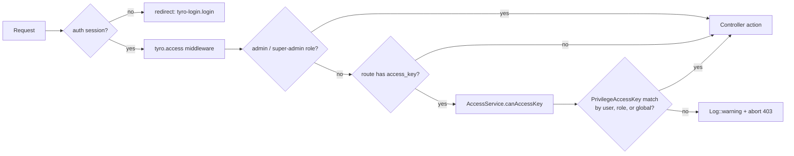
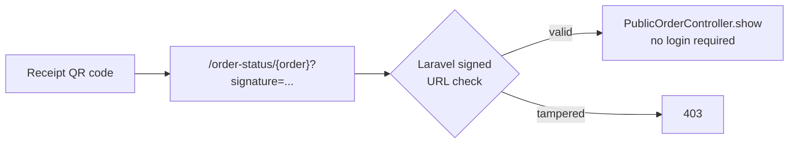
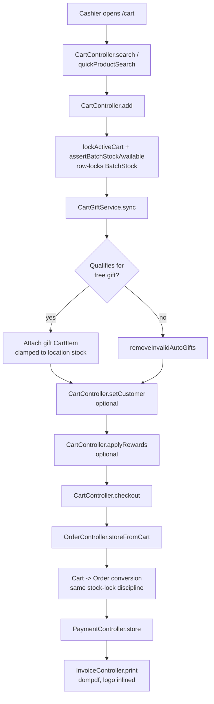
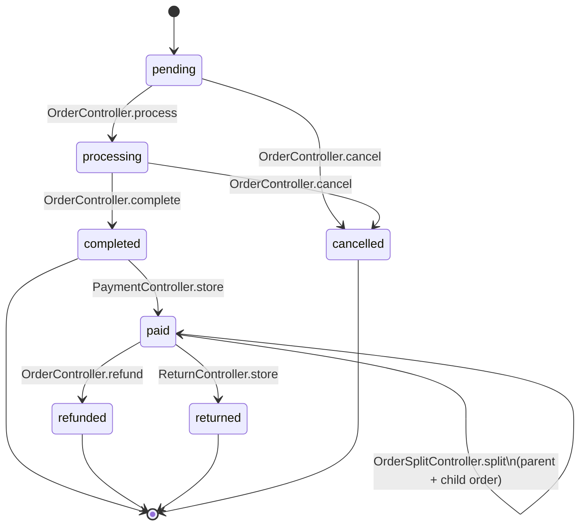
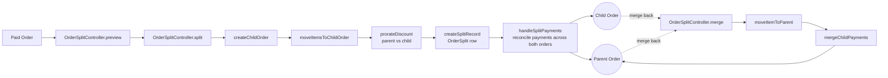
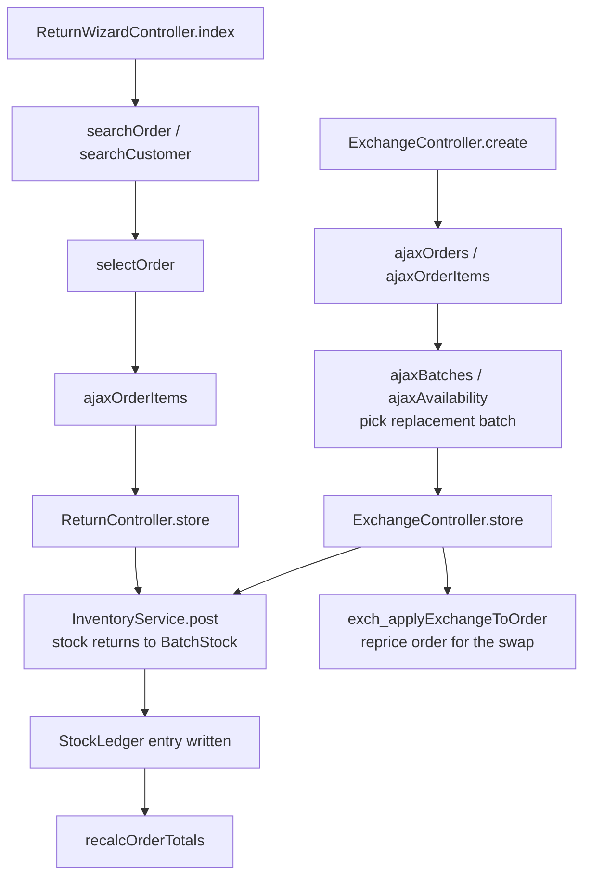
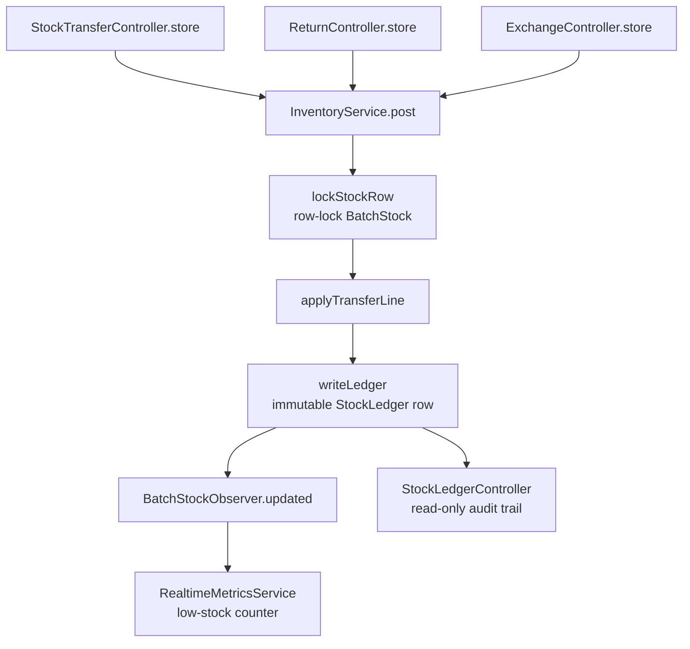
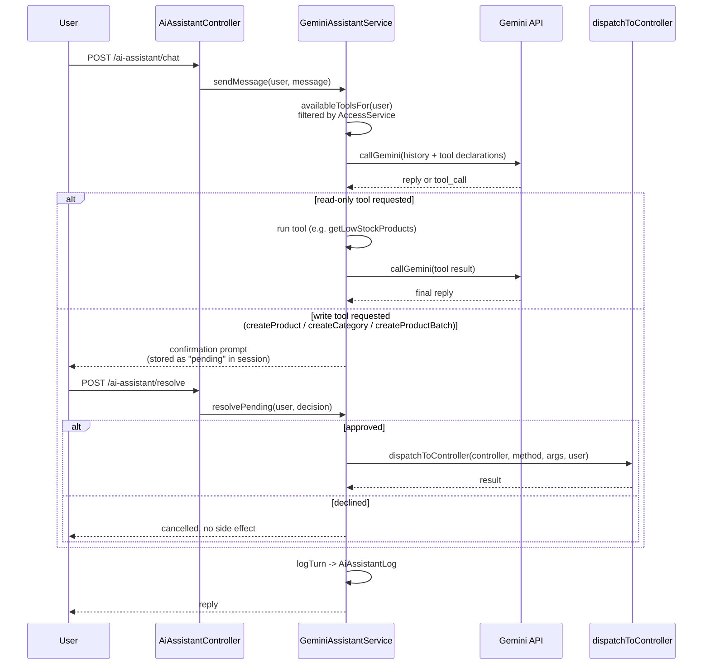
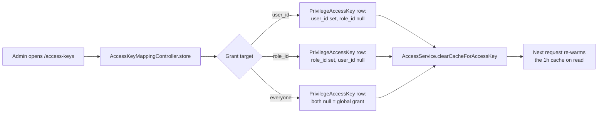

# JOJOBI Backoffice — Web Flow

Diagrams of how a request actually moves through `admin/`, from the shared
access-control gate down to the major business flows. Renders as Mermaid in GitHub,
VS Code (Markdown Preview), and most modern Markdown viewers.

---

## 1. Request / Access-Control Pipeline

Every route except the signed public order-status link passes through this exact
sequence before a controller method runs.

- Matches are cached 1h per `access_key` (`Cache::remember`).
- **Deny by default**: no matching row = 403 (`allowIfNoMapping = false`).
- `AiAssistantController@index/state/requestAccess` deliberately skip step E so an
  unprivileged user sees a "request access" screen instead of a bare 403.

---

## 2. POS Checkout Flow

---

## 3. Order Lifecycle

Soft-deleted orders go through a separate trash lane: `trash` → `restore` /
`restoreMultiple` → `forceDelete` / `forceDeleteMultiple` / `emptyTrash`.

---

## 4. Order Split / Merge

---

## 5. Returns & Exchange Flow

---

## 6. Stock Movement — the InventoryService Funnel

Every stock-affecting action in the app, regardless of trigger, converges on the
same locked write path.

---

## 7. AI Assistant Conversation Loop

Conversation history and any pending confirmation live in the **session**
(`historyKey`/`pendingKey` per user), not the database — only the final tool-call
outcome is persisted, to `AiAssistantLog`.

---

## 8. RBAC Access-Key Grant Flow

Also branching off `/access-keys`: `approveAiAccessRequest` /
`denyAiAccessRequest` resolve rows in `AiAccessRequest` created when a user without
the `ai_assistant` key clicks "request access" on the assistant's landing page.
